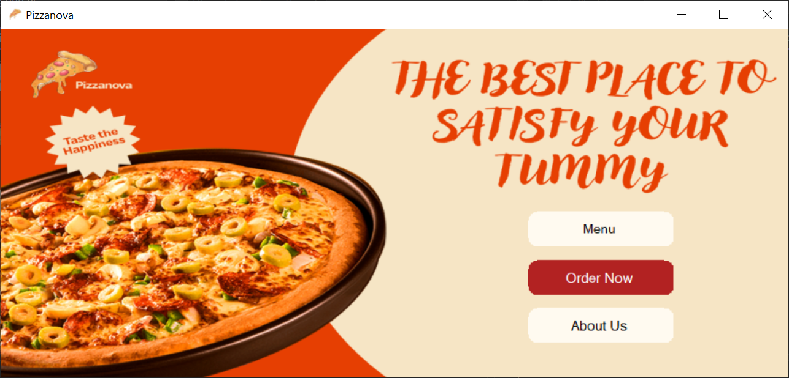
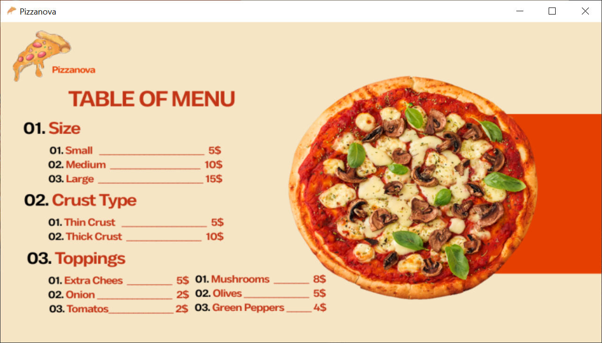
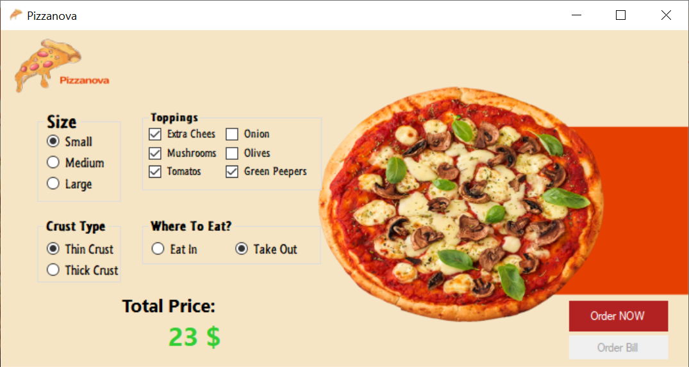
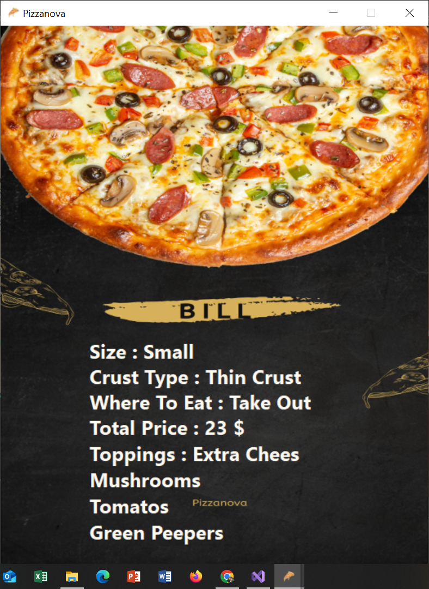
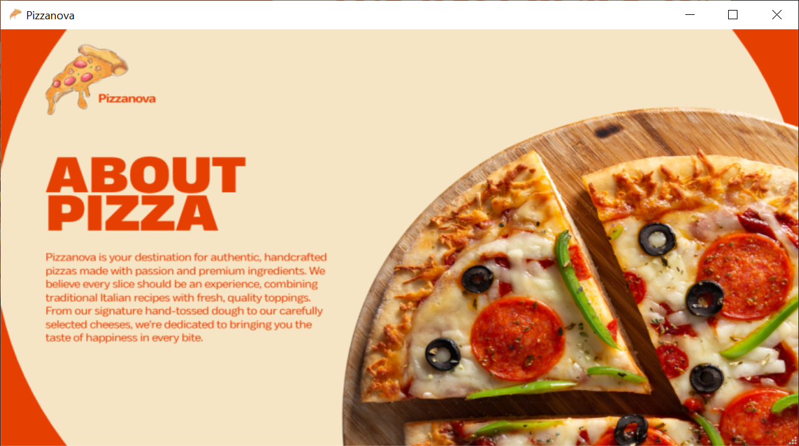

# 🍕 Pizzanova
A small Frontend desktop application for managing a pizza shop, built with C# Windows Forms.

## Overview
Pizzanova is a small user interface application for a pizza shop. This project represents my first foray into front-end development. 
The project includes three main interfaces (Menu, Order Now, About Us), in addition to a main interface when the application is opened and secondary interfaces for order confirmation and bill display.

## Features
- **Pizza Customization** — Choose size, crust type, and toppings to build your perfect pizza
- **Real-time Price Calculation** — Total price updates instantly based on your selections
- **Dining Preference** — Select between Eat In or Take Out
- **Order Confirmation** — Confirmation popup before finalizing the order
- **Bill Display** — Detailed bill showing all order selections and total price
- **Interactive Menu** — Browse all available sizes, crust types, and toppings with prices

## Interfaces

| Screen | Description |
|---|---|
| **Main Screen** | Entry point when the application opens |
| **Menu** | Browse available pizzas and items |
| **Order Now** | Place and customize your order |
| **Order Confirmation** | Review order before finalizing |
| **Bill Display** | View final bill and total |
| **About Us** | Information about Pizzanova |

## Screenshots

**Main Screen**

**Menu**

**Order Now**

**Bill**

**About Us**

